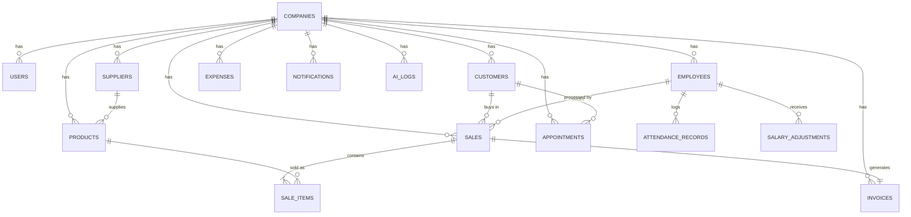

# SmartBiz AI — Database ERD (Phase 3)

مطابق للتصميم المعتمد في Phase 1 (Ch. 24)، مع تفاصيل إضافية (attendance, salary_adjustments) استُنتجت من Ch. 17.

## ملخص الجداول (13 جدول)

| الجدول | الغرض | ملاحظة تصميم |
|---|---|---|
| `companies` | جذر الـ tenant | `business_type` كـ ENUM |
| `users` | حسابات الدخول | `email` فريد globally |
| `employees` | ملفات الموظفين | — |
| `attendance_records` | حضور يومي | UNIQUE (employee_id, work_date) |
| `salary_adjustments` | مكافآت/خصومات | مربوطة بشهر الدفع `period_month` |
| `suppliers` | الموردون | — |
| `customers` | العملاء/المرضى | `balance_due` للدين |
| `products` | المخزون | فهرس على (company_id, quantity, minimum_stock) لـ Low-Stock |
| `sales` | المبيعات | — |
| `sale_items` | بنود البيع | `unit_price`/`unit_cost` **snapshot** وقت البيع (لا تتأثر بتعديل السعر لاحقًا) |
| `invoices` | الفواتير | `invoice_number` فريد لكل شركة وليس عالميًا |
| `expenses` | المصاريف | — |
| `appointments` | المواعيد | — |
| `notifications` | الإشعارات | فهرس جزئي على غير المقروء فقط |
| `ai_logs` | سجل عمليات AI | `confirmed` = true فقط بعد مراجعة المستخدم |

## قواعد Multi-tenancy المطبّقة

1. كل جدول عملياتي يحمل `company_id UUID NOT NULL REFERENCES companies(id)`.
2. فهرس (`INDEX`) على `company_id` في كل جدول لضمان أداء الاستعلامات المُصفّاة به.
3. `ON DELETE CASCADE` على `company_id` — حذف شركة يحذف كل بياناتها (يُستخدم فقط في بيئة التطوير؛ الإنتاج سيعتمد Soft Delete على مستوى الشركة أيضًا لاحقًا).
4. الحذف الناعم (`deleted_at`) على الجداول ذات الطابع المالي/المرجعي (`users`, `employees`, `products`, `suppliers`, `customers`, `expenses`) لتفادي فقدان السجلات المالية التاريخية.
